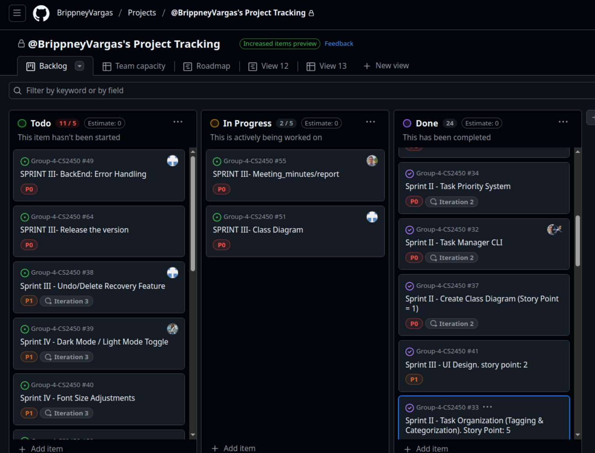

## **Agile Artifacts**

1. **Project Planning URL:**

   - GitHub Project: [https://github.com/users/BrippneyVargas/projects/5/views/1](https://github.com/users/BrippneyVargas/projects/5/views/1)

   This link should take you to a board or project management tool where your **initial tasks** and **backlog** are listed and organized.

2. **GitHub Repository Link:**

   - GitHub Repository Link: [https://github.com/BrippneyVargas/Group-4-CS2450/tree/main](https://github.com/BrippneyVargas/Group-4-CS2450/tree/main)

3. Screenshot of projects managment tools (SPRINT II)
   Sprint II- Week 1:
   [image](https://github.com/user-attachments/assets/4ae1cf34-2928-421c-94da-1fee431695a6)

   Sprint II- Week 2:
   

   Sprint III- Week 1&2:
  
  

